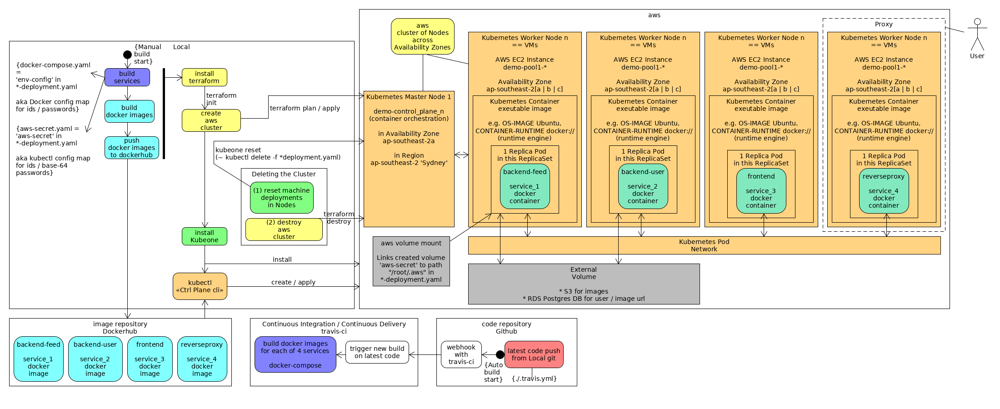

# PROJECT 3 - Refactor Udagram App into Microservices and Deploy

## 1. CI/CD, Github & Code Quality

- [GitHub code repository](https://github.com/wfs/cloud-developer/tree/master/course-03/exercises)
- ### Setup and deploy project
  - Simply clone or download the main project from [Github](https://github.com/wfs/cloud-developer)
  - build the docker images
  ```terminal
  $ sudo docker-compose -f course-03/exercises/udacity-c3-deployment/docker/docker-compose-build.yaml build
  ```
  - Run the docker containers
  ```terminal
  course-03/exercises/udacity-c3-deployment/docker$ sudo docker-compose up
  ```
- ### Main building blocks, manual build / deploy

  

1. Code & Libraries: HTML / CSS / [Typescript](https://www.typescriptlang.org/docs/home.html) -> JavaScript / [NodeJS](https://odejs.org/en/) / configuration files / environment variables.

2. [Docker](https://docs.docker.com/) build of microservices into images. Store of docker images on [dockerhub repository](https://hub.docker.com/repositories).

   ```terminal
   # Build a docker image with Docker file.

   andrew@andrew-Alienware-Aurora-R5:~/dev/cloud-developer/course-03/exercises/udacity-c3-deployment/docker$ sudo docker build -t openflocks/reverseproxy .

   # View your built images. Push to dockerhub image repository.

   andrew@andrew-Alienware-Aurora-R5:~/dev/cloud-developer/course-03/exercises/udacity-c3-frontend$ sudo docker images
        REPOSITORY                        TAG                 IMAGE ID            CREATED             SIZE
        openflocks/udacity-frontend       latest              06cb7e79c0d7        16 hours ago        1.38GB
        openflocks/udacity-restapi-feed   latest              9715e9431575        16 hours ago        1.12GB
        openflocks/udacity-restapi-user   latest              cbdf81cfbfd3        17 hours ago        1.12GB
        node                              12                  961bb6b05db5        34 hours ago        908MB
        alpine                            latest              965ea09ff2eb        4 weeks ago         5.55MB

   andrew@andrew-Alienware-Aurora-R5:~/dev/cloud-developer/course-03/exercises/udacity-c3-frontend$ sudo docker push openflocks/udacity-frontend
   ```

3. Infrastructure As Code: [Terraform](https://www.terraform.io/) enables us to plan and apply a clustered DEMO environment (network, compute, storage, IAM) on [aws](https://aws.amazon.com/).

   ```terminal
   # Create the aws infrastructure using terraform.

   andrew@andrew-Alienware-Aurora-R5:~/Documents/kubeone/examples/terraform/aws$ terraform plan

   andrew@andrew-Alienware-Aurora-R5:~/Documents/kubeone/examples/terraform/aws$ terraform apply
   ```

4. [Kubeone](https://github.com/kubermatic/kubeone/blob/master/docs/quickstart-aws.md) / kubectl to create and retrieve docker images from dockerhub and apply as docker containers in separate Pods.

   ```terminal
   # Install kubernetes and create worker nodes.

   andrew@andrew-Alienware-Aurora-R5:~/Documents/kubeone/examples/terraform/aws$ kubeone install config.yaml --tfjson .

   # Note: Kubeone automatically downloads the kubeconfig file for the cluster e.g. "demo-kubeconfig".
   ```

#### Automated CI / CD

1. With `./.travis.yml` in project root, add a webhook in Github with [travis-ci](https://travis-ci.org/wfs/cloud-developer), select your [Github](https://github.com/wfs/cloud-developer/tree/master/course-03/exercises) repository from travis-ci to monitor for new code pushes. Automated builds of the docker services images will occur on each new git push from Local.
   

## 2. Container

### Docker files

```terminal
./udacity-c3-deployment/docker/Dockerfile
./udacity-c3-frontend/Dockerfile
./udacity-c3-restapi-feed/Dockerfile
./udacity-c3-restapi-user/Dockerfile
```

### Docker images

```terminal
$ sudo docker images

REPOSITORY                        TAG                 IMAGE ID            CREATED             SIZE
openflocks/udacity-frontend       latest              7a366b0fb0f0        2 hours ago         37.2MB
openflocks/udacity-restapi-feed   latest              295c0dcd3752        2 hours ago         1.15GB
openflocks/udacity-restapi-user   latest              a8f754846f80        2 hours ago         1.15GB
openflocks/reverseproxy           latest              7552e69cb96b        2 hours ago         21.5MB
node                              12                  961bb6b05db5        2 weeks ago         908MB
beevelop/ionic                    latest              a831ad5b9e77        2 weeks ago         2.81GB
nginx                             alpine              a624d888d69f        2 weeks ago         21.5MB
alpine                            latest              965ea09ff2eb        6 weeks ago         5.55MB
```

### Dockerhub images


### Docker container services running locally


## 3. Deployment

- Deployed to kubernetes cluster on aws
  

- Upgrade a service

```terminal
andrew@andrew-Alienware-Aurora-R5:$ cd udacity-c3-deployment/k8s

andrew@andrew-Alienware-Aurora-R5:$ kubectl convert -f backend-user-deployment.yaml | kubectl create -f -
kubectl convert is DEPRECATED and will be removed in a future version.
In order to convert, kubectl apply the object to the cluster, then kubectl get at the desired version.
deployment.apps/backend-user created

andrew@andrew-Alienware-Aurora-R5:$ kubectl apply --dry-run=true --validate=true -f backend-user-deployment.yaml
deployment.apps/backend-user configured (dry run)

andrew@andrew-Alienware-Aurora-R5:$ kubectl apply -f backend-user-deployment.yaml
Warning: kubectl apply should be used on resource created by either kubectl create --save-config or kubectl apply
deployment.apps/backend-user configured
```

- Rolling update
  

- A/B deployment of the application

  > [Deployment strategies](https://github.com/ContainerSolutions/k8s-deployment-strategies) using kubernetes and load balancer configuration.

- Monitoring via [Amazon Cloudwatch](https://docs.aws.amazon.com/en_pv/AmazonCloudWatch/latest/monitoring/WhatIsCloudWatch.html)
